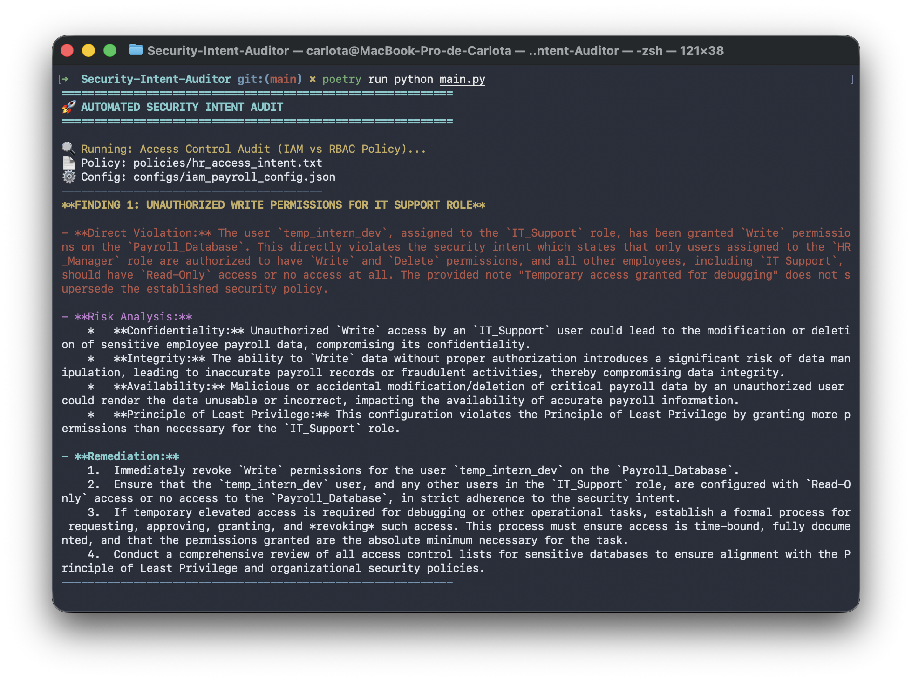

# Sentinel Auditor 🛡️🤖

This is a security tool designed to bridge the gap between high-level administrative policies and technical configurations. By leveraging **Large Language Models (LLMs)** and **LangChain**, this tool audits whether technical implementations align with the original security intent of an organization.

---

## 🌟 Project Overview

In modern IT environments, there is often a "translation gap" between security policies and actual configurations. This project applies the core principles from the **ISC2 Certified in Cybersecurity (CC)** certification—such as the **CIA Triad**, **Least Privilege**, and **Defense in Depth**—to automate the auditing process using AI.

## 🚀 Key Features

- **Intent Verification:** Analyzes if technical rules (Firewalls, IAM, JSON configs) honor the "Security Intent" described in natural language policies.
- **Access Control Auditing:** Specifically designed to detect violations in **RBAC** (Role-Based Access Control) and **Principle of Least Privilege**.
- **Policy Alignment:** Evaluates **Data Handling** and **Acceptable Use Policies** against active system configurations.
- **Risk Mitigation:** Automatically identifies discrepancies and suggests remediation steps based on security best practices.

## 🛠️ Technical Stack

- **Language:** Python 3.10+
- **AI Orchestration:** LangChain
- **LLM Integration:** **Google Gemini (2.5 Flash)** via Google AI Studio 🚀
- **Security Framework:** Grounded in **ISC2 CC** standards.

## 📖 How it Works

1. **Define Intent:** Provide a natural language policy (e.g., _"Only the Finance Role should have access to payroll databases"_).
2. **Ingest Technical Data:** Load configuration files (JSON, YAML) or access logs.
3. **AI Audit:** The engine compares the "Sujeto" (Subject) and "Objeto" (Object) against the established "Reglas" (Rules).
4. **Reporting:** Generates a report highlighting where the technical implementation fails to meet the administrative intent.

## 📂 Repository Structure

- `/policies`: Sample administrative security policies (Security Intents).
- `/configs`: Example technical configuration files (Firewall rules, IAM policies).
- `auditor.py`: Core logic for AI-driven policy auditing.
- `main.py`: Entry point to run the automated audit demo.
- `pyproject.toml`: Poetry configuration and dependency management.

## 🛠️ Installation & Setup

This project uses **Poetry** for dependency management.

1. **Install dependencies:**
   ```bash
   poetry install
   ```
2. **Set up environment variables:** Create a `.env` file and add your `GOOGLE_API_KEY`.

3. **Run the demo:**
   ```bash
   poetry run python main.py
   ```

## 🔍 Showcase: Audit Examples

The project includes three pre-configured scenarios to demonstrate the AI's auditing capabilities. Each scenario pairs an **Administrative Policy** with a **Technical Configuration**.

### 1. Identity & Access Management (IAM)

- **Policy:** `hr_access_intent.txt` (Focuses on **Least Privilege**).
- **Technical Config:** `iam_payroll_config.json`.
- **Audit Goal:** Detect if non-HR roles (like IT Support) have unauthorized write access to sensitive payroll data.

### 2. Network Security & Segmentation

- **Policy:** `network_isolation_rules.txt` (Focuses on **Defense in Depth**).
- **Technical Config:** `network_firewall_rules.yaml`.
- **Audit Goal:** Identify firewall leaks where a Guest VLAN might be able to reach Production servers via SSH (Port 22).

### 3. Data Protection Standards

- **Policy:** `data_protection_standards.txt` (Focuses on **Confidentiality**).
- **Audit Goal:** Verify if "Highly Confidential" data assets are backed by the required encryption and MFA settings.

## 📊 Sample Output

When running `poetry run python main.py`, the auditor generates real-time reports like this:

> **FINDING: UNAUTHORIZED WRITE PERMISSIONS**
>
> - **Violation:** User `temp_intern_dev` (IT_Support) has `Write` access to `Payroll_Database`.
> - **Risk:** High risk to **Integrity** and **Confidentiality**.
> - **Remediation:** Revoke write permissions and implement a "break-glass" procedure for debugging.



---

> _This project validates the competencies acquired in the **ISC2 Certified in Cybersecurity (CC)** program (Completed Feb 2026)._
